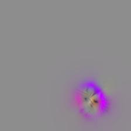

# pytorch cnn_preferred

  Generate a preferred image/video for the target units in arbitrary CNN model written in pytorch.

| features[12]                                                 | features[14]                                                 | features[17]                                                 | features[21]                                                 |                         features[28]                         | classifier[6]                                                |
| ------------------------------------------------------------ | ------------------------------------------------------------ | ------------------------------------------------------------ | ------------------------------------------------------------ | :----------------------------------------------------------: | ------------------------------------------------------------ |
| ![preferred_img_layer_features[12]_channel_111](image_gallery/preferred_img_layer_features[12]_channel_111.jpg) | ![preferred_img_layer_features[14]_channel_10](image_gallery/preferred_img_layer_features[14]_channel_10.jpg) | ![preferred_img_layer_features[17]_channel_174](image_gallery/preferred_img_layer_features[17]_channel_174.jpg) | ![preferred_img_layer_features[21]_channel_95](image_gallery/preferred_img_layer_features[21]_channel_95.jpg) | ![preferred_img_layer_features[28]_channel_5](image_gallery/preferred_img_layer_features[28]_channel_5.jpg) | ![preferred_img_layer_classifier[6]_channel_168](image_gallery/preferred_img_layer_classifier[6]_channel_168.jpg) |
| ![preferred_img_layer_features[12]_channel_188](image_gallery/preferred_img_layer_features[12]_channel_188.jpg) | ![preferred_img_layer_features[14]_channel_102](image_gallery/preferred_img_layer_features[14]_channel_102.jpg) | ![preferred_img_layer_features[17]_channel_260](image_gallery/preferred_img_layer_features[17]_channel_260.jpg) | ![preferred_img_layer_features[21]_channel_183](image_gallery/preferred_img_layer_features[21]_channel_183.jpg) | ![preferred_img_layer_features[28]_channel_311](image_gallery/preferred_img_layer_features[28]_channel_311.jpg) | ![preferred_img_layer_classifier[6]_channel_410](image_gallery/preferred_img_layer_classifier[6]_channel_410.jpg) |
| ![preferred_img_layer_features[12]_channel_244](image_gallery/preferred_img_layer_features[12]_channel_244.jpg) | ![preferred_img_layer_features[14]_channel_164](image_gallery/preferred_img_layer_features[14]_channel_164.jpg) | ![preferred_img_layer_features[17]_channel_362](image_gallery/preferred_img_layer_features[17]_channel_362.jpg) | ![preferred_img_layer_features[21]_channel_406](image_gallery/preferred_img_layer_features[21]_channel_406.jpg) | ![preferred_img_layer_features[28]_channel_427](image_gallery/preferred_img_layer_features[28]_channel_427.jpg) | ![preferred_img_layer_classifier[6]_channel_601](image_gallery/preferred_img_layer_classifier[6]_channel_601.jpg) |

These are the preferred images of some channels in the layer of VGG16 trained on ImageNet dataset.

## Description

  This repository contains Python codes for generating a preferred image/video of the target units in a CNN model. The preferred image is generated based on the "activation maximum" method which generates images such that the target unit(s) can have high activation value (vectors).

  Here, we can generate a preferred image in arbitrary CNN model written in pytorch. I already tried pretrained AlexNet, VGG19, ResNet50, Densenet121, Inception-v3, provided by torchvision. I also tried 3D CNN optimized for video input such as C3D ([pretrained on Sports1M dataset](https://github.com/DavideA/c3d-pytorch)), and 3D ResNet50 inflated from 2D RGB model  ([pertained on Moments in time dataset](https://github.com/metalbubble/moments_models )). Please try to your own CNN. Enjoy!

## Requirements

I checked this repository work correctly in this environment:

- Python 3.6
- Numpy 1.14.2
- Scipy 0.19.0
- PIL 5.0.0
- Pytorch 0.4.1
- Torchvison 0.2.1

## Usage

The key component is extracting intermediate layer activation. See `example/Instruct_extracting_intermediate_feature.ipynb` and try to run it.

Generating preferred image code is at `example/preferred_image_shortest_demo.ipynb`. You can generate preferred image without concerning any parameters. If you consider the parameters carefully, check `example/preferred_image_demo_simpleCNN_conv` or `example/preferred_image_demo_complexCNN_conv.ipynb`.

## Image Gallery

Here area the example results of a various network. First one is preferred images of a maximized channel. The second one is that of a maximized unit. The parameter doesn't change as the example code expect the number of iteration (n_iter: 200 to 2000).

### Images maximimizing a channel

- ResNet50 (pretrained on ImageNet)

| layer3[5].conv3                                              | layer4[0].conv1                                              | layer4[2].conv3                                              | fc                                                           |
| ------------------------------------------------------------ | ------------------------------------------------------------ | ------------------------------------------------------------ | ------------------------------------------------------------ |
| ![preferred_img_layer_layer3[5].conv3_channel_422](image_gallery/preferred_img_layer_layer3[5].conv3_channel_422.jpg) | ![preferred_img_layer_layer4[0].conv1_channel_315](image_gallery/preferred_img_layer_layer4[0].conv1_channel_315.jpg) | ![preferred_img_layer_layer4[2].conv3_channel_1192](image_gallery/preferred_img_layer_layer4[2].conv3_channel_1192.jpg) |  |
| ![preferred_img_layer_layer3[5].conv3_channel_471](image_gallery/preferred_img_layer_layer3[5].conv3_channel_471.jpg) | ![preferred_img_layer_layer4[0].conv1_channel_363](image_gallery/preferred_img_layer_layer4[0].conv1_channel_363.jpg) | ![preferred_img_layer_layer4[2].conv3_channel_1305](image_gallery/preferred_img_layer_layer4[2].conv3_channel_1305.jpg) |  |

- DenseNet121 (pretrained on ImageNet)

| db2.dl12.conv2                                               | db3.dl16.conv2                                               | db4.dl16.conv2                                               | classifier                                                   |
| ------------------------------------------------------------ | ------------------------------------------------------------ | ------------------------------------------------------------ | ------------------------------------------------------------ |
|  |  |  |  |
|  |  |  |  |

(db… denseblock, ds… denselayer)

- Inception-v3 (pretrained on ImageNet)

| Mx_5d.bc5x5_2.conv                                           | Mx_6a_bc3x3dbl_3.conv                                        | Mx_7b_bc_pool                                                | fc                                                           |
| ------------------------------------------------------------ | ------------------------------------------------------------ | ------------------------------------------------------------ | ------------------------------------------------------------ |
|  |  |  |  |
|  |  |  |  |

(Mx… Mixed, bc… branch)

- 3D ResNet50 (pretrained on Moments in Time dataset)

  These results are preferred videos of 16 frames input (shown as gif). Note that this model trained on 16 frame inputs at 5 fps. Preferred videos are not good quality especially higher layer (hard to see meaningful expression). If you can generate a good one, please tell me how to do that.

| layer2[3].conv3                                              | layer3[5].conv3                                              | layer4[2].conv3                                              | fc (last_linear)                                             |
| ------------------------------------------------------------ | ------------------------------------------------------------ | ------------------------------------------------------------ | ------------------------------------------------------------ |
| ![preferred_img_layer_layer2[3].conv3_channel_164](image_gallery/preferred_img_layer_layer2[3].conv3_channel_164.gif) | ![preferred_img_layer_layer3[5].conv3_channel_354](image_gallery/preferred_img_layer_layer3[5].conv3_channel_354.gif) | ![preferred_img_layer_layer4[2].conv3_channel_1037](image_gallery/preferred_img_layer_layer4[2].conv3_channel_1037.gif) |  |
| ![preferred_img_layer_layer2[3].conv3_channel_254](image_gallery/preferred_img_layer_layer2[3].conv3_channel_254.gif) | ![preferred_img_layer_layer3[5].conv3_channel_1021](image_gallery/preferred_img_layer_layer3[5].conv3_channel_1021.gif) | ![preferred_img_layer_layer4[2].conv3_channel_1562](image_gallery/preferred_img_layer_layer4[2].conv3_channel_1562.gif) |  |

### Images maximizing a unit

- Resnet50

| layer3[0].conv1                                              | layer3[5].conv3                                              | layer4[2].conv3                                              |
| ------------------------------------------------------------ | ------------------------------------------------------------ | ------------------------------------------------------------ |
| ![preferred_img_layer_layer3[0].conv1_channel_12_y_3_x_26](image_gallery/preferred_img_layer_layer3[0].conv1_channel_12_y_3_x_26.jpg) | ![preferred_img_layer_layer3[5].conv3_channel_956_y_5_x_8](image_gallery/preferred_img_layer_layer3[5].conv3_channel_956_y_5_x_8.jpg) | ![preferred_img_layer_layer4[2].conv3_channel_1151_y_6_x_3](image_gallery/preferred_img_layer_layer4[2].conv3_channel_1151_y_6_x_3.jpg) |
| ![preferred_img_layer_layer3[0].conv1_channel_224_y_19_x_4](image_gallery/preferred_img_layer_layer3[0].conv1_channel_224_y_19_x_4.jpg) | ![preferred_img_layer_layer3[5].conv3_channel_543_y_9_x_5](image_gallery/preferred_img_layer_layer3[5].conv3_channel_543_y_9_x_5.jpg) | ![preferred_img_layer_layer4[2].conv3_channel_234_y_2_x_1](image_gallery/preferred_img_layer_layer4[2].conv3_channel_234_y_2_x_1.jpg) |

- DenseNet121

| db2.dl12.conv2                                               | db3.dl16.conv2                                               | db4.dl16.conv2                                               |
| ------------------------------------------------------------ | ------------------------------------------------------------ | ------------------------------------------------------------ |
|  |  |  |
|  |  |  |

- Inception-v3

| Mx_5d.bc5x5_2.conv                                           | Mx_6a_bc3x3dbl_3.conv                                        | Mx_7b_bc_pool                                                |
| ------------------------------------------------------------ | ------------------------------------------------------------ | ------------------------------------------------------------ |
|  |  |  |
|  |  |  |

### Version

version 1.0 #released at 2019/03/13

### Copyright and license

The codes in this repository are based on "CNN preferred image (cnnpref)" (https://github.com/KamitaniLab/cnnpref), which is written for "Caffe". These scripts are released under the MIT license.

Copyright (c) 2018 Kamitani Lab (<http://kamitani-lab.ist.i.kyoto-u.ac.jp/>)

### Author

Ken Shirakawa

Master student at Kamitani lab, Kyoto University (http://kamitani-lab.ist.i.kyoto-u.ac.jp)

